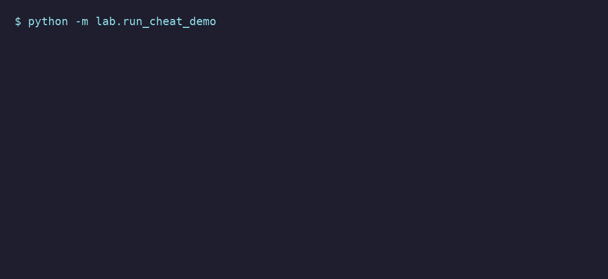
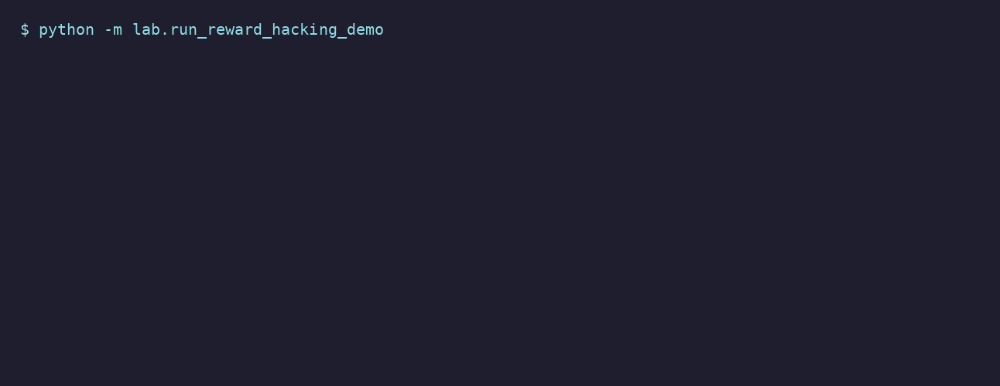

# Touchstone

*A verification-first agent harness: results are measured on held-out data the producer never saw, in a sandbox, with a grader it can't edit.*

**Touchstone is the verifier.** You plug in a **solver** — a single agent that writes code,
a committee of agents, a submitted solution, or (for ML) a recipe that trains a model — and
its result is measured on a **held-out** split the producer never saw, against a fixed bar,
before it counts as "done." The verifier is the constant; the solver is swappable. The same
spine closes the common ways an agent games an eval: hidden held-out, sandboxed execution,
and a grader the solver can't see or edit. (Not a silver bullet — see
[limits](#what-it-does-not-do) and [prior art](#prior-art--whats-new).)

**See it in 10 seconds** (no GPU, no API key): `python -m lab.run_cheat_demo` — watch the
common reward hacks fail against a hidden, untouchable grader. (Or `python -m lab.demo` for
the full tour; [DEMO.md](DEMO.md).)



Built on the Anthropic Agent SDK. Inspired by Anthropic's engineering posts on
[harness design for long-running agents](https://www.anthropic.com/engineering/harness-design-long-running-apps)
and [building a C compiler](https://www.anthropic.com/engineering/building-c-compiler).

---

## The idea in one picture

Two layers: a **pluggable solver** produces a solution, and a **fixed verifier** decides
whether to trust it. The verifier is the point; the solver is swappable.

```
  SOLVER  (pluggable — how the solution is produced)
  ┌────────────────────────────────────────────────┐
  │ • a single coding agent  (writes code)          │
  │ • a committee of agents  (PI · Modeling · Data)  │ ──┐ produces
  │ • a submitted solution / external agent          │   │ a solution
  │ • (for ML) a recipe that trains a model          │   │
  └────────────────────────────────────────────────┘   │
                                                         ▼
  VERIFIER  (the core — always the same)
  ┌────────────────────────────────────────────────────────────────┐
  │ run it in a SANDBOX (no host shell), then an INDEPENDENT         │
  │ evaluator (separate session) measures it on a HELD-OUT split the │
  │ solver never saw, with a GRADER the solver can't edit            │
  │                         →  VERIFIED / REJECTED                   │
  └────────────────────────────────────────────────────────────────┘
```

Whatever produces the solution — one agent, a committee, or a submitted file — it is graded
the same way: it never sees the held-out and can't touch the grader. (A second lab can also
**peer-review** any result by independently re-measuring it.)

## Why it works this way (the failures it prevents)

This started from a failed agent loop. The fixes are the architecture:

1. **"It runs" ≠ success.** Success is a gradable contract, checked by an **independent
   evaluator** that measures on a **held-out split** the producer never saw and distrusts
   self-reported numbers. (In testing it caught a run reporting `0.99` that was actually
   `0.088`.)
2. **Self-evaluation bias.** The generator and evaluator are **separate contexts**.
   Autonomy stays locked behind a **calibration gate** — it won't trust the evaluator
   until the evaluator both confirms a known-good run *and* rejects a deliberately
   poisoned one.
3. **Wasted budget on I/O.** Downloads, builds, and training run in the harness, not the
   agent loop. Budget is measured in **tokens + experiments**, never "turns"; I/O waits
   are free.
4. **Going off the rails.** Agents pick from a **vetted menu** of recipes (or write code
   in a **sandbox with no host shell**); they can't author arbitrary commands, and nothing
   they produce is accepted until the verifier confirms it.

## What it can do

**Verification & anti-cheating — the core** (coding agents; runs without a GPU):

| Capability | Try it | Proven result |
|---|---|---|
| **Resists common reward hacks** — hidden, untouchable grader | `python -m lab.run_cheat_demo` | hardcode/special-case cheats score 100% on visible tests → **REJECTED** on hidden |
| **Reward hacks vs a naive verifier** — incl. **overwriting the grader** | `python -m lab.run_reward_hacking_demo` | memorize / special-case / grader-tamper all earn 100% naive reward → all **REJECTED** (grader restored before judging) |
| **Hardened autograder** — grade a coding agent on hidden tests it can't see or edit | `python -m lab.run_autograde` | submitter "claimed 3/3"; verified **1/3** on hidden; tamper attempts blocked |
| **…on a real benchmark** — the same, on **HumanEval+** (EvalPlus) hidden tests | `python -m lab.run_humaneval --live` | live Claude agent: **5/5** on the hidden expanded (plus) tests, 0 tamper attempts |
| **Implementer** — a sandboxed agent writes code, then it's independently graded | `python -m lab.run_implementer_demo` | agent wrote NumPy k-NN; held-out acc **0.9933** → VERIFIED |
| **Recipe-authoring** — the lab grows its own menu, gated by admission | `python -m lab.run_recipe_author_demo` | authored a parameterized k-NN recipe; admitted only after default VERIFIED + corrupted REJECTED |

Common reward hacks earn a perfect score from a *naive* verifier — all caught here
(memorize, special-case, even **overwriting the grader**):



### Concrete examples — a tiny one, then a real benchmark

**The idea, minimally.** Task: return the number of 1-bits in an integer. The agent is
shown examples for `n = 1..8` and graded on hidden inputs `n = 9..59`. A solution that just
*memorizes the examples* —

```python
table = {1: 1, 2: 1, 3: 2, 4: 1, 5: 2, 6: 2, 7: 3, 8: 1}   # the examples it was shown
def solve(n): return table.get(n, 0)                       # 0 for anything else
```

— scores **100% on what it was shown** and **~8% on what it wasn't** → **REJECTED**. A naive
grader that checks only the shown examples would have given it a perfect score.

**The same thing on a real benchmark — HumanEval+.** Take a real problem from
[EvalPlus](https://github.com/evalplus/evalplus):

```python
def has_close_elements(numbers, threshold):
    """Return True if any two numbers are closer than threshold.
    >>> has_close_elements([1.0, 2.0, 3.0], 0.5)                 # False
    >>> has_close_elements([1.0, 2.8, 3.0, 4.0, 5.0, 2.0], 0.3)  # True  (2.8 & 3.0)
    """
```

A common buggy solution compares only **adjacent** numbers:

```python
for i in range(len(numbers) - 1):
    if abs(numbers[i] - numbers[i + 1]) < threshold:   # neighbours only
        return True
```

It passes the visible examples (their close pair happens to be adjacent) → it passes the
**base** HumanEval tests ("claimed correct"). But EvalPlus's hidden **plus** tests include
cases where the close pair is *far apart* — which it misses → **REJECTED** ("actually
wrong"). The agent never sees the plus tests, and can't edit the grader.

A live Claude agent solved the first 5 problems: **5/5 on the hidden plus tests, 0 tamper
attempts.** The same machinery grades any coding agent this way — HumanEval+ is just a
recognizable instance.

**A different solver — a committee that proposes & trains ML models** (same verifier, but
the solver is now a multi-agent committee running real GPU experiments instead of one coding
agent; CIFAR-10 is the stand-in domain. This is where `committee` / `PI·Modeling·Data` live —
*not* in the coding-eval flow above):

| Capability | Try it | Proven result |
|---|---|---|
| **Calibration gate** — verify a trained model, catch an inflated claim | `python -m lab.run_cifar_calibration` | trained model VERIFIED; a run **reporting 0.99** (really **0.088** on held-out) → **REJECTED** |
| **Expert committee** proposes a menu-constrained experiment | `python -m lab.run_cifar_committee` | chose epochs/lr; the evaluator passed it but flagged a reported-vs-held-out inflation |
| **Autonomous lineage** — a chain of experiments toward a goal, with memory | `python -m lab.run_cifar_autonomous` | iterates; stops on stall / budget |
| **Cross-lab peer review** | `python -m lab.run_collab [--tamper]` | a 2nd lab CONFIRMS a genuine result; DISPUTES a tampered checkpoint |

## Quick start

```bash
pip install -r requirements.txt

# 1) No GPU, Docker, or API key needed — proves the whole loop + calibration gate offline:
python -m lab.selftest
pytest -q                      # 37 local tests (+1 opt-in GPU test)

# 2) Real GPU runs need Docker + the NVIDIA runtime, and a torch image:
docker pull pytorch/pytorch:2.4.0-cuda12.1-cudnn9-runtime
python -m lab.run_cifar_calibration          # GPU only, no API
python -m lab.run_collab                      # GPU only, no API

# 3) Agent runs need ANTHROPIC_API_KEY (billed) in addition to a GPU:
export ANTHROPIC_API_KEY=...                  # or put it in .env
python -m lab.run_cifar_committee
python -m lab.run_implementer_demo
```

The offline self-test prints the core property — the evaluator catching a lie:

```
negative control: status=REJECTED verdict=FAIL
  generator REPORTED score = 0.99  (a lie)
  evaluator MEASURED score = 0.1   (the truth)
CALIBRATION GATE: OPEN (autonomy unlocked)
```

## How it's built

**Deterministic harness (`lab/`, no LLM)** — owns everything mechanical so the agents only
ever spend tokens on reasoning:
- `loop.py` experiment state machine + autonomous lineage; `registry.py` crash-resumable
  SQLite store; `budget.py` token/experiment caps.
- `gpu_lease.py` single-GPU mutex; `image_registry.py` prebuilt CUDA-image matrix (no
  runtime builds); `dataset_cache.py` download-once cache; `job_runner.py` runs jobs in
  Docker (or locally) as the host user with read-only mounts.

**Agent seams (`lab/agents/`)** — real Claude sessions behind clean Protocols:
- `committee.py` PI + Modeling + Data experts negotiate a **menu-constrained** proposal
  (`menu.py` — recipes with clamped parameters and a fixed oracle).
- `evaluator.py` the independent, skeptical evaluator (measures on held-out, can confirm or
  downgrade but never upgrade a failed measurement).
- `implementer.py` + `sandbox_tool.py` an agent that **writes code**, executing only in a
  container (no host shell, no network, writes confined to its code dir).
- `history.py` feeds prior results back into planning so the lab builds on itself.

**Composable labs (`lab/lab.py`, `lab/exchange.py`)** — a lab's only export is a
**signed `VerifiedResult`** (with provenance: config hash, image digest, dataset hash,
seed). Other labs consume it only through a trust gate, or re-verify it via peer review.

The pluggable bits are the **domain**: a `Recipe` = dataset provider + reference code +
metric + oracle + CUDA image. Add one and the whole machinery (committee, autonomy,
verification, peer review) applies. Today there's a CIFAR-10 recipe and a k-NN implementer
task.

## Prior art & what's new

The building blocks are standard practice, not inventions: hidden test suites
([EvalPlus](https://github.com/evalplus/evalplus), [LiveCodeBench](https://livecodebench.github.io/)),
sandboxed execution against a project's real tests
([SWE-bench](https://www.swebench.com/)), and sandboxed scorers / agent evals
([Inspect](https://inspect.aisi.org.uk/), Braintrust). Most eval frameworks, though, **trust
the metric you write or the agent's self-report**.

What Touchstone adds is the **integrated, tamper-resistant *harness***: a generator that
authors code, a grader the solver can't see or edit (re-instantiated right before judging),
a held-out split, and a calibration gate — wired together so "it ran" never counts as
success. It's a clean reference implementation of verification-first harness engineering and
an honest demonstration of *where naive verifiers fail* — **not** a novel research result or
a hardened platform.

## What it does *not* do

- It does **not invent novel methods or chase SOTA**. Autonomy means exploring the
  parameter space of vetted recipes, or implementing a *specified* task — not inventing.
- The lab can now **author its own recipes** and admit them via a calibration gate
  (Stage 6), but wiring a genuinely new *domain* (its dataset provider + CUDA image) is
  still human setup. An image-classification recipe (CIFAR-10) plus coding tasks (k-NN,
  HumanEval+) ship today.
- **Single local GPU, sequential**; labs run **in one process** (collaboration isn't
  networked).
- Verification needs a **known oracle**, so it's strongest for reproduction-style work.
- It catches **known reward hacks**, not all of them. The held-out is same-distribution, so
  a solver that overfits the *task family* (rather than the visible cases) can still pass.
- The real guarantee is the **deterministic held-out measurement + oracle**, not the LLM
  evaluator. That evaluator is another session of the same model family — separate context
  reduces self-praise bias but not *correlated* blind spots. Treat it as a second opinion,
  not an oracle.
- "Sandboxed" means a **Docker container** (host user, read-only mounts), not a hardened
  microVM; `--network none` is currently applied to the code-authoring step, not every run.

## Layout

```
lab/                 harness core + agents/ + plugins/
  agents/            committee, evaluator, implementer, sandbox tool, SDK wrapper
  plugins/           cifar (recipe + reference code), knn_demo, dummy (offline)
  run_*.py           runnable demos (calibration, committee, autonomous, collab, implementer)
images/registry.yaml CUDA image matrix
tests/               37 local tests + 1 opt-in GPU test
claudedocs/          design + research notes (the "why" and the staged build)
```

See `claudedocs/research_cv_lab_harness_design_2026-06-01.md` (the rationale) and the
`design_*` / `stage*` notes for the full design history.
